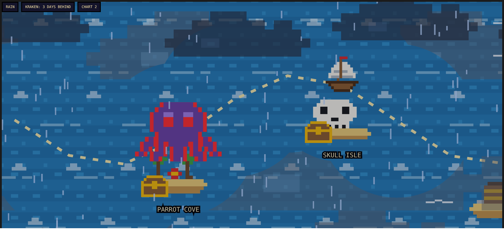
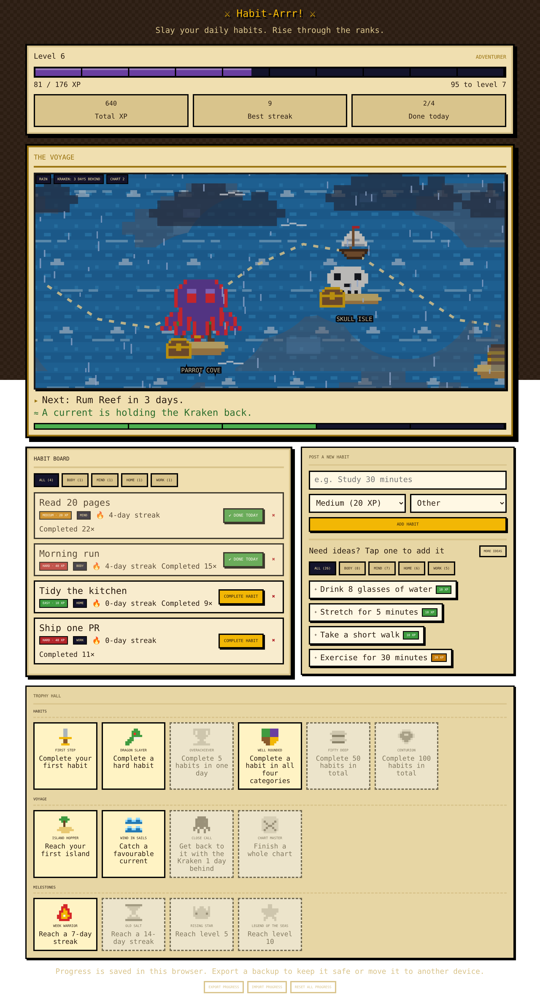

# Habit-Arrr! ⚔

A pirate/RPG-themed habit tracker that lives entirely in a single HTML file: no build step, no backend, no dependencies.



## What it does

- Add habits ("quests") with a difficulty (easy/medium/hard) and category (body, mind, home, work, other).
- Completing a quest earns XP, which levels you up and unlocks a title.
- Your progress also drives a pixel-art voyage: your ship sails across a chart while a caged Kraken chases from behind. Keep completing habits daily to stay ahead of it. Skip too many days and it catches you, sending your voyage progress (not your XP) back to the start.
- Unlock trophies for streaks, milestones, and voyage events.
- Progress is saved to `localStorage` in your browser. Use **Export progress** / **Import progress** in the footer to back up or move your data.

<details>
<summary>See the full app</summary>



</details>

## Running it

Just open `habit-arrr.html` in a browser, that's it.

```
open habit-arrr.html
```

No install, no server required.

## How the voyage/Kraken mechanic works

This part of the code (`habit-arrr.html`, "Voyage config" / "Voyage scene" sections) isn't obvious from
reading the UI alone, so here's the model:

- A **chart** is a route of `N = 12` waypoints. `state.voyage.p` is the ship's current waypoint index (0
  to `N-1`); reaching the last one starts a new chart.
- `state.k` is the Kraken's waypoint index. It starts at `START_K = -2`, two steps *behind* the route's
  start, caged and harmless. Your **lead** is `p - k`, in days.
- Completing your **first** habit of a day moves the ship forward one waypoint. On your very first
  completion of a chart, this also frees the Kraken from its cage (it doesn't move that same day).
- Every day you don't complete any habit, the Kraken advances one waypoint on its own, so idle days are
  the actual threat, not habit difficulty. If it ever reaches the ship (`k >= p`), the ship "sinks": chart
  progress resets to the start (XP and level are kept), and the Kraken goes back in its cage.
- **Weather** (calm → overcast → rain → storm → hurricane) is driven directly by your lead: less lead
  means worse weather, capped at `MAX_GAP = 5` days for full calm. The first `CALM_STEPS = 2` days after
  setting sail are always one step calmer, so leaving port doesn't immediately drop you into a storm.
- A **favourable current** kicks in once you're on a streak of `CURRENT_STREAK = 3`+ days: the Kraken's
  advance stalls every other day while it fights the current, so your lead grows over time. This stops
  helping once your lead reaches `CURRENT_MAX_LEAD = 8` days, so a long streak can't make you permanently
  untouchable.
- Islands are fixed waypoints (`ISLANDS`/`ISLAND_XP`) that award bonus XP and a cosmetic treasure chest the
  first time the ship reaches them.
- A **storm surge** is a telegraphed hazard, not a random ambush: once your lead drops to `STORM_TRIGGER_GAP
  = 2` days or worse, there's a `STORM_CHANCE = 35%` chance each day that a warning appears for the next
  day. If you stay idle on the warned day, the storm strikes and pushes the ship back `STORM_SURGE = 2`
  waypoints toward the Kraken; completing a habit that day sails you through it unscathed instead.

All of this is index-based (`p`, `k`, `N`) and independent of the scene's pixel geometry, which is worth
knowing if you're touching the rendering: the visual layout (waypoint coordinates, camera, terrain) can be
redesigned freely without affecting save data or gameplay, and vice versa.

## Testing

There's a small headless-browser smoke test in `test/smoke.mjs` that loads `habit-arrr.html` directly (no
server), adds and completes a habit, and checks XP/streak/achievement state updates with no console errors,
at both a narrow-phone and a desktop viewport width. Run it with:

```
npm install -D playwright   # once
node test/smoke.mjs
```

It's not a full test suite, just a fast sanity check to catch obvious regressions (a broken selector, a
layout that overflows, a script error) after changes to the app.
